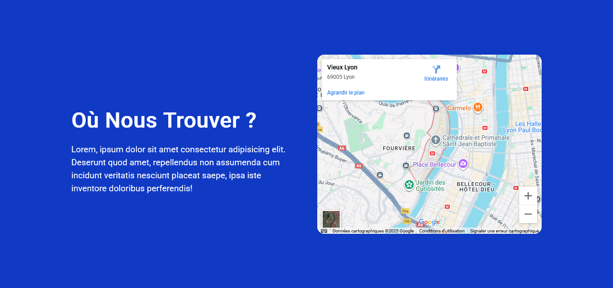

## GOOGLE MAPS DANS LES SITES WEB

## Le challenge

Ajout de la localisation via Google maps à une page web en utilisant le HTML5 et le CSS3.

## Démonstration

Lien vers le projet : https://aperbet56.github.io/google_maps_localisation/

## Projet développé avec

- Utilisation des balises sémantiques HTML5
- CSS3
- Flexbox
- Animations CSS
- Page web responsive
- Desktop first
- Importation de la police "Roboto"
- Utilisation d'un normaliseur : le fichier normalize.css
